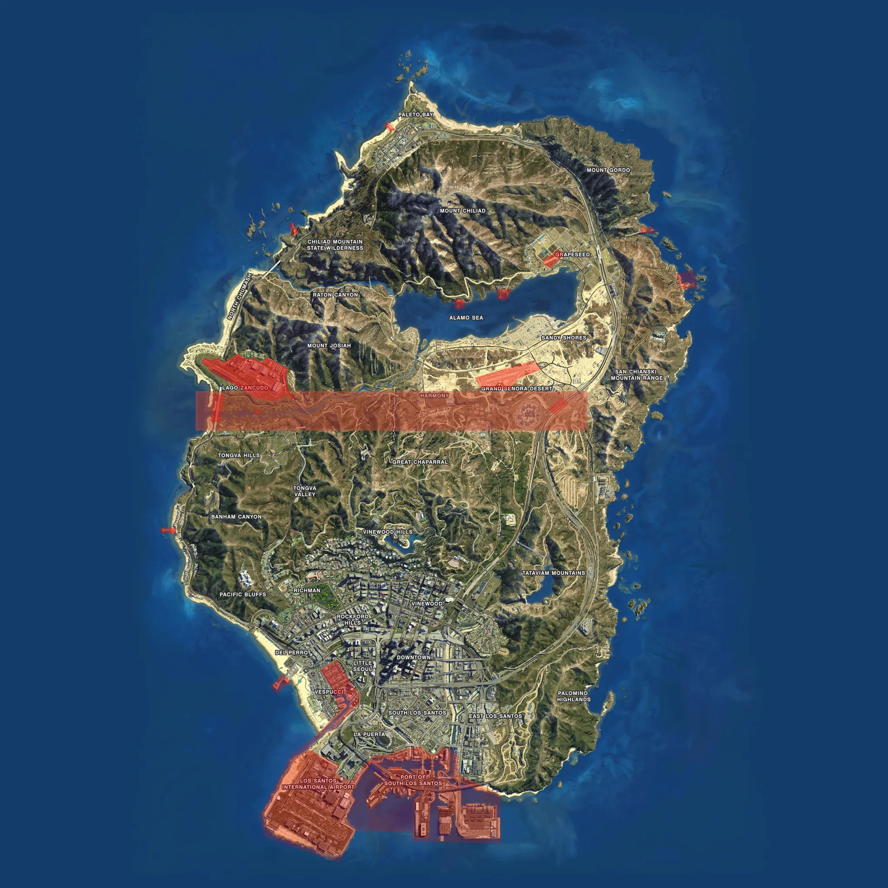
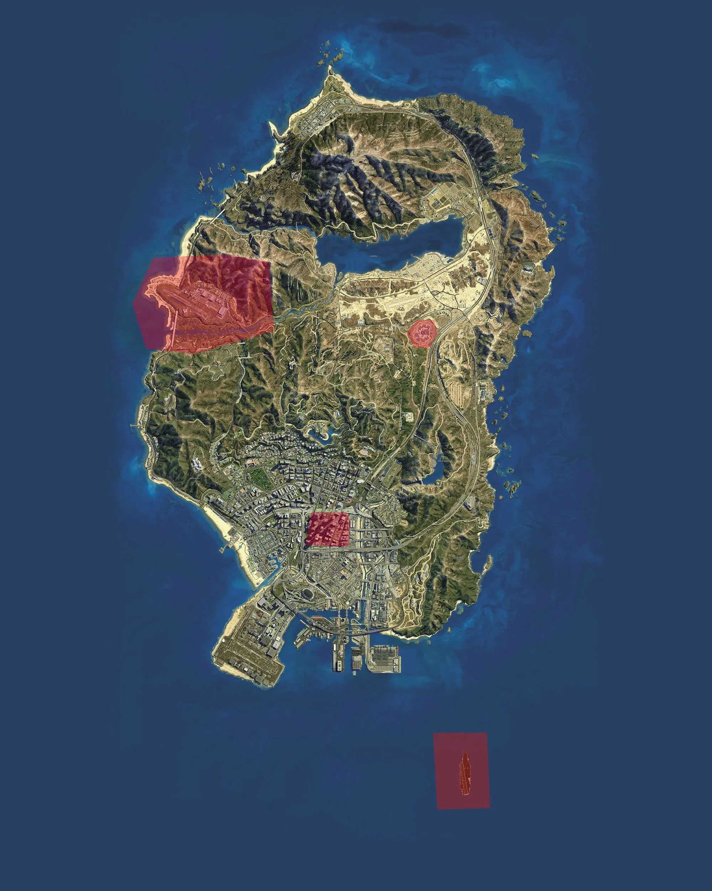

---
hide:
  - toc
---
# Risicogebieden

Amersveen kent meerdere risicogebieden. In een risicogebieden mag preventief gefouilleerd worden. Dus dat wilt zeggen dat ook voertuigen gecontroleerd mogen worden. Hier onder zijn deze gebieden aangegeven.

De korpsleiding is bevoegd om, in samenspraak met de Hoge Raad van Amersveen, aanvullende risicogebieden aan te wijzen. Denk hierbij aan een noodverordering. Hiervoor gelden dezelfde regels als de normale risicogebieden.

## Kaartweergave

**Postcode**

_Grote Bank_ (Nationale Nederlandse Bank)

- 597
- 596
- 593
- 600
- 599
- 598

_Bank_ (Linker snelweg)

- 436
- 437
- 438

_Bank_ (Bank Paleto)

- 022
- 023
- 042
- 041
- 026
- 025

_Bank_ (Route 68)

- 260
- 259
- 247

_Bank_ (Bank Blokkenpark + Blokkenpark)

- 752
- 745
- 746
- 751
- 753
- 755
- 756
- 757
- 750
- 747

_Bank_ Fleeca Bank

- 627

_Bank_ (Basic Fit)

- 614

_Gevangenis_

- 365
- 366
- 364
- 363
- 362

_Parkeerplaats Lombank_

- 675

_ANWB_ 

- 768

_Politie_

- 704

_Pier_

- 688
- 687

_Ambulance + GemeenteHuis_

- 632
- 640
- 642
- 641
- 629

_Maze Bank Arena_

- 862 
- 858 
- 853

- -------------------------------------------

---
# Douanegebieden binnen Amersveen

Amersveen kent meedere douanegebieden. In deze risicogebieden mag preventief gefouilleerd worden. Dus dat wilt zeggen dat ook voertuigen gecontroleerd mogen worden. Hier onder zijn deze gebieden aangegeven.

De korpsleiding is bevoegd om, in samenspraak met de gemeenteraad van Amersveen, aanvullende douanegebieden aan te wijzen. Hiervoor gelden dezelfde regels als de normale douanegebieden.

## Kaartweergave

----------------------------------------------

# No Fly Zone (NFZ)

De volgende gebieden zijn aangemerkt als no fly zones.

* Militaire basis
* Gevangenis
* Blokkenpark tot een hoogte van 300 meter (1000 feet)
* Vliegdekschip

Hier onder staan deze zones weergegeven Amersveen.

